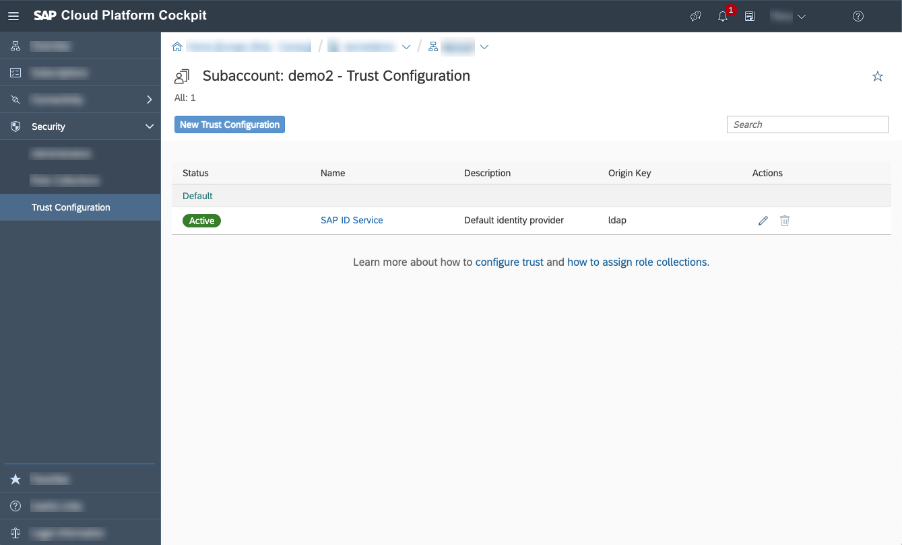
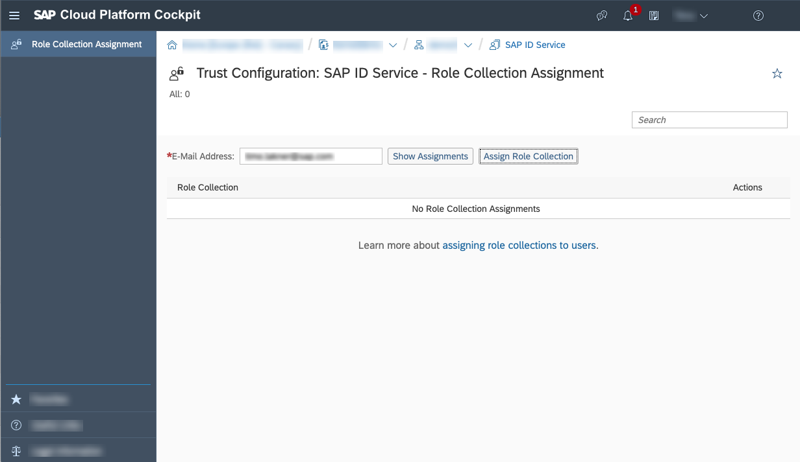

<!-- loio0735965d10b342a393b5a83924dba9b4 -->

# Assign the Subaccount Service Administrator Collection

<a name="loio0735965d10b342a393b5a83924dba9b4__context_zvk_sxq_zmb"/>

## Context

The procedure shows how to assign new service administrator role collections to a user of your choice.

## Procedure

1.  In the SAP BTP cockpit, navigate to your subaccount and select *Security* \> *Trust Configuration* \> *SAP ID Service*.

      

2.  Enter the e-mail of the user you want to assign the role collection to in the *E-Mail Address* field.

      

3.  Add the user to the SAP ID service:

    1.  Select *Show Assignments*.

    2.  Select *Add User* in the popup menu.

4.  Assign *Role Collection*:

    1.  Select *Assign Role Collection*.

    2.  In the following popup menu, select *Subaccount Service Administrator* as the *Role Collection*.

    3.  Select *Assign Role Collection*.

5.  \(Optional\) Repeat the steps 2. to 4. with additional users who should have the access to the SAP Service Manager APIs.

